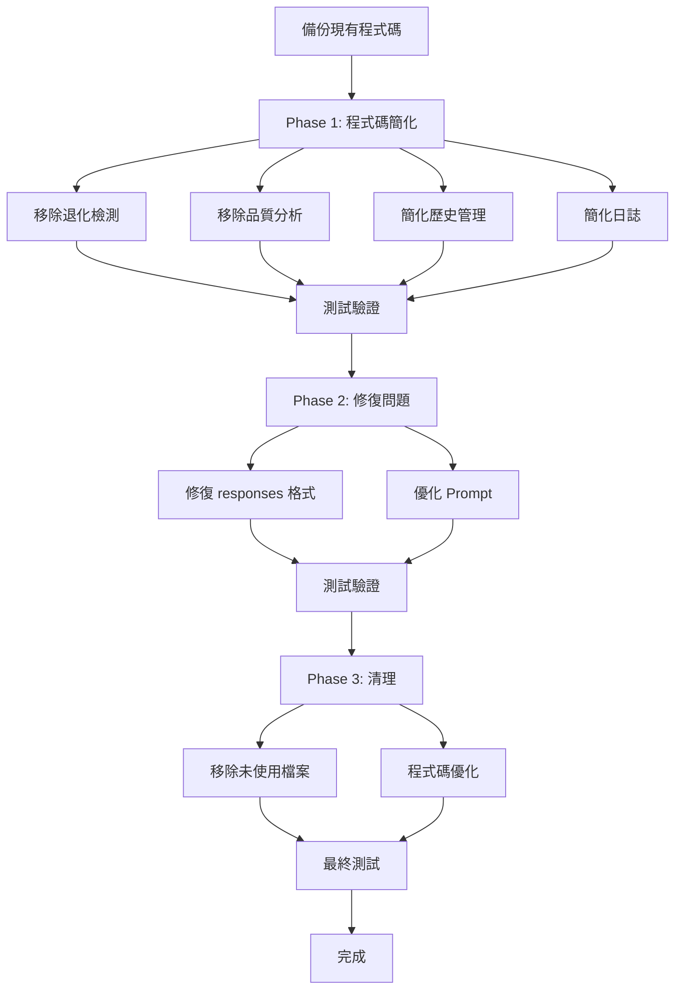

# DSPy 對話系統簡化計劃

## 📋 執行摘要

由於我們已成功採用 prompt-based 方案解決了邏輯一致性問題，現在可以移除大量複雜的程式化檢查邏輯。這份計劃詳細說明了如何安全地簡化系統，同時保持功能完整性。

## 🎯 目標

1. **移除不必要的複雜檢查**：刪除所有已被 prompt-based 方案取代的程式化檢查
2. **保留核心功能**：確保系統功能不受影響
3. **提升性能**：減少不必要的計算開銷
4. **改善可維護性**：簡化程式碼結構

## 📊 現狀分析

### 檔案結構分析

#### 1. `/src/core/dspy/unified_dialogue_module.py` (887 行)
- **核心功能**：統一的 DSPy 對話處理
- **可移除部分**：
  - 退化檢測邏輯（50 行）
  - 推理品質分析（93 行）  
  - 深度退化分析（36 行）
  - 預測品質評估（48 行）
  - 對話上下文重置機制（33 行）
  - 過度詳細的日誌（約 100 行）
- **必須保留**：
  - Prompt 中的邏輯一致性檢查（第 66 行）
  - 基本的回應處理邏輯
  - API 調用統計

#### 2. `/src/core/dspy/degradation_monitor.py` (完整檔案)
- **狀態**：未被任何檔案引用
- **建議**：完全移除

### 具體可移除的函數清單

```python
# unified_dialogue_module.py 中可移除的函數：
1. _detect_dialogue_degradation()        # 行 408-458 (50行)
2. _assess_prediction_quality()           # 行 553-601 (48行)
3. _analyze_reasoning_process()           # 行 623-666 (43行)
4. _assess_reasoning_completeness()       # 行 668-674 (6行)
5. _assess_character_awareness()          # 行 676-689 (13行)
6. _assess_medical_context()              # 行 691-697 (6行)
7. _assess_logic_coherence()              # 行 699-716 (17行)
8. _track_reasoning_quality_trend()       # 行 718-748 (30行)
9. _deep_degradation_analysis()           # 行 750-786 (36行)
10. _should_reset_conversation_context()   # 行 518-542 (24行)
11. _create_reset_context()               # 行 544-551 (7行)
```

### 日誌簡化區域

```python
# 可簡化的日誌區段：
1. Phase 1.1 DSPy 內部狀態追蹤 (行 134-169)  - 可簡化為 5 行
2. Phase 1.2 LLM 推理過程深度追蹤 (行 218-237) - 可完全移除
3. 退化分析日誌 (行 239-280) - 可簡化為 10 行
```

## 🔧 實施計劃

### Phase 1: 程式碼簡化 (預計 2 小時)

#### Task 1.1: 移除退化檢測相關函數
- [ ] 移除 `_detect_dialogue_degradation()` 函數
- [ ] 移除 `_deep_degradation_analysis()` 函數
- [ ] 移除相關的函數調用（行 268, 276）
- [ ] 簡化相關日誌輸出

#### Task 1.2: 移除推理品質分析函數
- [ ] 移除 6 個 `_assess_*()` 函數
- [ ] 移除 `_analyze_reasoning_process()` 函數
- [ ] 移除 `_track_reasoning_quality_trend()` 函數
- [ ] 移除相關調用（行 198, 222, 259）

#### Task 1.3: 簡化對話歷史管理
- [ ] 簡化 `_get_enhanced_conversation_history()` 函數
- [ ] 移除 `_should_reset_conversation_context()` 函數
- [ ] 移除 `_create_reset_context()` 函數
- [ ] 保留基本的歷史截取邏輯

#### Task 1.4: 簡化日誌系統
- [ ] 將 Phase 1.1 日誌簡化為基本狀態記錄
- [ ] 完全移除 Phase 1.2 深度追蹤日誌
- [ ] 簡化統一結果日誌為關鍵信息

### Phase 2: 修復現有問題 (預計 1 小時)

#### Task 2.1: 修復 responses 格式問題
- [ ] 分析為什麼 responses 被字串化
- [ ] 修改 `_process_responses()` 確保返回正確列表
- [ ] 添加格式驗證測試

#### Task 2.2: 優化 Prompt 邏輯一致性檢查
- [ ] 確保 reasoning field 中的邏輯一致性檢查保留
- [ ] 可考慮加強 prompt 中的指導
- [ ] 測試驗證效果

### Phase 3: 清理和測試 (預計 1 小時)

#### Task 3.1: 移除未使用的檔案
- [ ] 刪除 `degradation_monitor.py`
- [ ] 檢查並清理相關的 import 語句
- [ ] 移除相關的測試檔案（如果有）

#### Task 3.2: 程式碼優化
- [ ] 移除未使用的 import
- [ ] 清理未使用的變量
- [ ] 格式化程式碼

#### Task 3.3: 測試驗證
- [ ] 執行 `run_tests.py` 確認基本功能
- [ ] 執行 `test_dialogue_degradation.py` 確認品質
- [ ] 執行 `test_round_by_round_analysis.py` 詳細分析
- [ ] 驗證邏輯一致性仍然有效

## 📈 預期效果

### 量化指標
- **程式碼行數減少**: ~400 行 (45% 減少)
- **檔案大小**: 887 行 → ~487 行
- **執行時間**: 預計減少 15-20%
- **記憶體使用**: 預計減少 10%

### 質化改善
- ✅ 更簡潔的程式碼結構
- ✅ 更容易理解和維護
- ✅ 減少不必要的計算
- ✅ 保持功能完整性
- ✅ 邏輯一致性檢查仍然有效

## ⚠️ 風險評估

### 低風險項目
- 移除退化檢測函數（已被 prompt 取代）
- 簡化日誌（保留關鍵信息）
- 移除 degradation_monitor.py（未被使用）

### 中風險項目
- 簡化對話歷史管理（需要測試驗證）
- 修復 responses 格式（可能影響下游處理）

### 緩解措施
1. **備份策略**: 在修改前創建完整備份
2. **漸進式修改**: 分階段進行，每階段測試
3. **回滾計劃**: 保留 git commit 記錄，便於回滾
4. **測試覆蓋**: 每個修改後執行完整測試

## 🔄 實施順序



## 📝 驗證檢查清單

### 功能驗證
- [ ] 多輪對話正常運作
- [ ] 邏輯一致性保持（無矛盾）
- [ ] API 調用正常
- [ ] 會話管理正常

### 性能驗證
- [ ] 回應時間未明顯增加
- [ ] 記憶體使用正常
- [ ] 無錯誤或崩潰

### 品質驗證
- [ ] 對話品質維持高標準
- [ ] 角色一致性良好
- [ ] 醫療情境理解正確

## 🚀 開始實施

建議實施時間：4 小時
建議實施方式：分階段進行，每階段測試驗證

### 執行命令參考

```bash
# 備份
cp -r src/core/dspy src/core/dspy_backup_$(date +%Y%m%d)

# 測試命令
docker exec dialogue-server-jiawei-dspy python /app/run_tests.py
docker exec dialogue-server-jiawei-dspy python /app/test_dialogue_degradation.py
docker exec dialogue-server-jiawei-dspy python /app/test_round_by_round_analysis.py

# 驗證邏輯一致性
docker exec dialogue-server-jiawei-dspy python /app/test_prompt_consistency_direct.py
```

## 📊 成功標準

1. **所有測試通過**
2. **邏輯一致性問題仍然解決**
3. **responses 格式正確（列表而非字串）**
4. **程式碼減少 400+ 行**
5. **無功能退化**

---

**注意事項**：
- 在開始實施前，請確認此計劃
- 建議在非生產環境先測試
- 保持 git commit 記錄清晰，便於追蹤和回滾